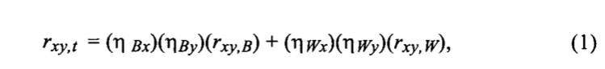

# Psychology-of-science
### Theme: Individual and Nomothetic Models of Job Stress: An Examination of Work Hours, Cohesion, and Well-Being

### **Author**
| Author 1      |     Author 2       | 
| :-----------:|:-----------:   |
|  PAUL D. BLIESE |  RONALDR. HALVERSON |        

## Tutorial of the newsvendor problem with barter exchange  

  
<b>Table of Contents</b>

  <ol>
    <li>
      <a href="#Introduction">Introduction</a>
      <ul>
        <li><a href="#Individual Level Perspectives of Job Stress">Individual Level Perspectives of Job Stress</a></li>
        <li><a href="#Nomothetic Perspectives of Job Stress">Nomothetic Perspectives of Job Stress</a></li>
    </li>
      </ul>
    <li>
      <a href="#Method">Method</a>
      <ul>
        <li><a href="#Research Sample">Research Sample</a></li>
        <li><a href="#Measures">Measures</a></li>
        <li><a href="#Assessing Within-GroupAgreement">Assessing Within-GroupAgreement</a></li>
        <li><a href="#Individual- and Group-Level Analyses">Individual- and Group-Level Analyses</a></li>
    </li>
      </ul>
    <li>
      <a href="#Results">Results</a>
      <ul>
        <li><a href="#Descriptive Statistics">Descriptive Statistics</a></li>
        <li><a href="#Agreement Score Results">Agreement Score Results</a></li>
        <li><a href="#Individual and Group Relationships WABAResults">Individual and Group Relationships WABAResults</a></li>
    </li>
      </ul>
    <li>
      <a href="#Discussion">Discussion</a>
      <ul>
        <li><a href="#Equivocal Results">Equivocal Results</a></li>
        <li><a href="#A Note on Negative Affectivity">A Note on Negative Affectivity</a></li>
</ol>

      
# __Introduction__
This repository is a tutorial for the implementation of __Individual and Nomothetic Models of Job Stress: An Examination of Work Hours, Cohesion, and Well-Being__ based on the design of the paper _"Individual and Nomothetic Models of Job Stress: An Examination of Work Hours, Cohesion, and Well-Being"_  by [Bliese, P. D., & Halverson, R. R. (1996)]("[https://www.sciencedirect.com/science/article/abs/pii/S0925527313001837?via%3Dihub](https://psycnet.apa.org/record/1996-05414-004)"). I wrote this tutorial as a showcase of application for the psychology workshop.

## __Individual Level Perspectives of Job Stress__
> The study of job stress is dominated by models that emphasize individual perceptions as key components in the link between the environment and outcomes.

> __(1)Frequently cited job stress theories such as cybernetic theory (Cummings & Cooper, 1979; Edwards, 1992)__
> 
> __(2)Person-environment fit theory(French,Caplan,&Harrison,1982)__
> 
> __(3)Transactional model(Lazarus&Folkman,1984)__
> 
> __(4)Facet model (Beehr & Newman, 1978)__ 

> Share `one key` similarity: They are based on the assumption that `individual differences in personal variables` such as `personality characteristics` ,`abilities`, `beliefsv, and goals play crucial roles in determining how individuals perceive and respond to their environments. 

## __Nomothetic Perspectives of Job Stress__
> In job stress research, one may also examine consistencies in how groups of individuals appraise and react to their environments.

> Support for the nomothetic perspective of job stress research rests on establishing `two conditions`

>First, it is important to demonstrate that group members agree about assessments of their work environments (i.e., their work climates), since establishing within-group agreement is crucial to the argument that climates exist (James, 1982; Klein, Dansereau, & Hall, 1994).

>Second, it is important to demonstrate that there are differences in work climates across groupsandthatthesedifferencesarerelatedtogroupoutcomessuchaswell-being.

>In the current study, we contrast individual and nomothetic perspectives of job stress by examining the linkages between several components of the work environment and psychological well-being. Specifically, we conducted a mul- tilevel examination of the relationships among `(a) work hours`, `(b) vertical cohesion`, `(c) horizontal cohesion`, and `(d) the dependent variable, psychological well-being`. On theoretical grounds, these variables can be conceptualized from either the individual or nomothetic perspectives. We begin by discussing psychological well-being.

>`(a)`We believe that the two perspectives test different aspects of the relationship between work hours and well-being. The nomothetic perspective examines whether the average well-being in a group is a function of the groups’ work load climate. The individual-level perspective examines whether an individual’s well-being is a function of the hours he or she reports working.

>`(b)(c)`Vertical and horizontal cohesion are constructs reflecting the quality of relationships within groups (Griffith, 1989; Marlowe, 1986). Vertical cohesion reflects subordinates’ perceptions that leaders are considerate and competent. Horizontal cohesion is a measure of the degree of fraternal bonding and kinship within a group. Previous research indicates that individual-level assessments of both vertical and horizontal cohesion are positively related to self-reports of well-being (Appel, 1966; Glass, 1972; Little, 1964; Manning, 1991; Manning & Fullerton, 1988).

# __Ｍethod__

## __Research Sample__
> __True groups__. The data for this study were drawn from a larger study of soldiers in noncombat environments. Questionnaire data assessing aspects of command climate and well-being were collected between May and December of 1985 from U.S. Army companies stationed in Europe and the U.S. (Griffith, 1989). The study population consisted of completed questionnaires from __7,382__ enlisted personnel with the lowest five enlisted ranks. The soldiers were drawn from 99 different U.S. Army companies. U.S. Army company representation ranged in size from 15 to 226, with a mean of 55.72. On average, the soldiers had spent 4.78 months in their companies.

>__Random groups__. The data from the __7,382__ respondents were randomly reassigned into 99 random groups having the exact size characteristics as the 99 U.S. Army companies (e.g., low of 15 to high of 226, final mean of 55.72). This process was repeated `five times`. __The formation of five sets of random groups allowed us to contrast the real-group results with results from randomly formed groups__.

## __Measures__
>The General Well-Being Schedule was used as a measure of mental health in a survey of 6,913 adults aged 25 to 74 as part of the Health and Nutritional Examination Survey (HANES) con- ducted by the National Center for Health Statistics (1979), and has been used in several published studies (Husaini, Neff, & Stone, 1979; Neff & Husaini, 1980). The measure is an 18-item scale measuring depression, anxiety, somatic complaints, positive well-being, and emotional control (a= .91). Dupuy (1978) proposed that the General Well-Being Schedule was a measure of the overall effect of the many factors which affect an individual’s health.
Work hours. On the survey, work hours was assessed by asking soldiers “How many hours do you usually work in a day?”
Vertical and horizontal cohesion. The Vertical Cohesion Scale is an 1l-item scale (a= 39). Typical items are: “My officers are interested in my personal welfare” and “The NCOs in this company would lead well in combat.” The Horizontal Cohesion Scale is an eight-item scale (a= .83). Typical items are: “I spend time when not on duty with people in this company” and “My closest relationships are with the people I work with.” Confirmatory factor analyses indicate that the scales are distinct, but correlated ( r = .46). Additional infor- mation on the psychometric properties of the scales can be obtained from the authors.

## __Assessing Within-GroupAgreement__
>In group-level analyses, the aggregation of individual responses into a group score treats group members as judges rating the environment. Therefore, as indicated above, it is important to demonstrate that group members “agree” before claiming that a construct is a group-level climatic variable (James, 1982; Klein et al., 1994). 

>In this study, within-group agreement was estimated for work hours, vertical cohesion, and horizontal cohesion using two measures. The firstmeasure,__the intraclass correlation coefficient ICC(l)__,providesanestimateof the reliability of an individual respondent’s rating and may be used as a measure of within-group agreement (Bartko, 1976; James, 1982). The second measure was a __random group resampling procedure (RGR)__ developed by Bliese, Halverson, and Rothberg (1994, 1995).This RGR procedure compares the variances from actual groups with the variances from numerous (e.g., 5,000) randomly formed “groups.” The RGR procedure provides an omnibus t test of whether actual group variances are smaller than would be expected by chance. Significant negative t tests indicate significant within-group agreement.

>Within-group agreement values for well-being are presented for comparison purposes. As we stated earlier, `we do not consider it necessary to demonstrate agreement for well-being` because we do not conceptualize well-being as a climatic variable on which respondents should agree. Because we are interested in examining differences in group means for well-being, however, `we consider it important to demonstrate reliable mean differences across groups`. To estimate the reliability of mean differences across groups, the __intraclass correlation coefficient ICC(2)__ was calculated for well-being and the other variables in the study (James, 1982). For comparison purposes, ICC(1) and ICC(2) were also calculated for the five sets of randomly formed groups described earlier.

## __Individual- and Group-Level Analyses__
>To examine differences between individual and nomothetic (i.e., group- level) perspectives, __within and between analyses__ (WABA) were conducted __(Dansereau, Alutto, & Yammarino, 1984; Markham, 1988)__.

>__WABA__ is a procedure for creating and contrasting between-unit and within-unit correlations. In WABA, `the between-unit correlation` is a group-level correlation based on __group means weighted__ by __group size__. `The within-unit correlation` is based on __an individual’s relative position within the group and holds differences across groups constant__ (Dansereau et al., 1984; Markham, 1988).

>In WABA analyses, one makes inferences about group and individual effects in the context of the rewritten covariance theorem given in Equation 1 below (Dansereau et al., 1984; Markham, 1988):

  

<table>
  <tr>
    <td>Notation</td>
    <td>Description</td>
  </tr>
  <tr>
    <td>rxy,t</td>
    <td>Raw Correlation</td>
  </tr>
  <tr>
    <td>ηBx</td>
    <td>Between-eta correlation for variable x</td>
  </tr>
  <tr>
    <td>ηBy</td>
    <td>Between-eta correlation for variable y</td>
  </tr>
  <tr>
    <td>rxy,B</td>
    <td>Between-unit correlation</td>
  </tr>
  <tr>
    <td>ηWx</td>
    <td>Within-eta correlation for variable x</td>
  </tr>
  <tr>
    <td>ηWy</td>
    <td>Within-eta correlation for variable y</td>
  </tr>
  <tr>
    <td>rxy,W</td>
    <td>Within-unit correlation</td>
  </tr>
</table>

### WABA provides four potential outcomes (Dansereau et al. 1984;Markham, 1988)

>In the `wholes` (i.e., group) model, the between-unit correlation is significant and the within-unit correlation is null. 

>In the `parts` (i.e., individual) model, the within-unit correlation is significant and the between-unit correlation is null.

>In the `equivocal` model, both correlations are statistically significant, but do not significantly differ from each other.

>In the `null` model, neither correlation is significant.

# __Result__

## __Descriptive Statistics__

>`Table 1` provides __means__, __standard deviations__,and __individual level correlations__ for the variables in the study.All correlations except __the correlation between work hours__ and __horizontal cohesion__ are __significant (p < 0.001)__. Because of the large sample size, some of the correlations may lack practical significance.

  

## __Agreement Score Results__

>The nomothetic perspective of work stress proposes that respondents from within the same work group should show agreementon assessmentsof the group’s work environment. The within-group agreement score results are presented in Table 2. As indicated by __James (1982)__,__ICC( 1)__ measures of within-group agreement generally `range from 0 to 0.50` with a `median of 0.12`. There are, however, __no definitive guidelines for determining acceptable values__. 

  

>From `Table 2`, it is apparent that __ICC(1)__ values are __strongest__ for perceptions of `work hours (0.17)` and `vertical cohesion(0.16)`.__ICC(1)__ values are relatively __weak__ for perceptions of `horizontal cohesion (0.06)` and `well-being (0.06)`. The __RGR__ results show that there is significant __within-group agreement (p < .01)__ for `work hours`, `vertical cohesion`, and `well-being`. The __t value__ for `horizontal cohesion`, in contrast, is __not significant__ at the `0.05` convention (t= -1.30,< .10,one-tailed).

>The __ICC(2)__ values from Table 2 suggest that the 99 U.S. Army companies can be clearly differentiated in terms of their `mean scores` on `hours worked`, `vertical cohesion`, `horizontal cohesion`, and `well-being` (0.92, 0.92, 0.78, and 0.77, respectively). In general, the ICC(I), RGR, and ICC(2) results provide evidence that aggregation is appropriate, although __the RGR results for horizontal cohesion__ indicate that aggregation may be __questionable__ for this variable.

>`Table 2` also presents the ICC results for __the five sets of random groups__. In each run, the 7,382 respondents were randomly assigned to 99 groups having the exact size characteristics as the 99 U.S. Army companies. The random group aggregations represent the average results from five separate runs of 99 groups. It is clear from Table 2 that random group ICC values are considerably smaller than U.S. Army company ICC values. __In all cases, the random group ICCs are zero or negative__.

## __Individual and Group Relationships: WABA Results__

>Table 3 presents __the WABA results__ in the form of the __rewritten covariance theorem (Dansereau et al., 1984)__

